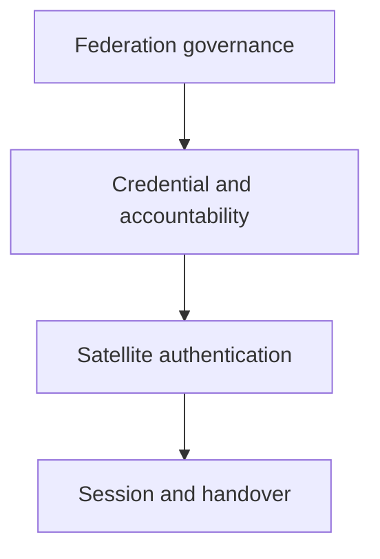

[繁體中文版](ARCHITECTURE_zh-TW.md)

# Thesis architecture

## Scope

This repository is the research and implementation workspace for a
post-quantum, privacy-preserving, accountable authentication mechanism for
satellite networks. PQ-RBBC is one cryptographic module inside that system; it
is not the complete thesis architecture.

The system target is:

- post-quantum authentication and session-key establishment;
- anonymous, issuer-unlinkable access with explicit linkability boundaries;
- conditional, threshold-governed identity opening;
- low communication and verification cost on the satellite online path;
- replay-resistant access and handover under changing serving context; and
- auditable claim boundaries between specification, prototype, and closed
  implementation evidence.

## System layers

| Layer | Responsibility | Current repository status |
| --- | --- | --- |
| Federation governance | configuration, issuer authorization, opening authorization, independent threshold keys | architecture defined; concrete DKG and protocol implementation open |
| Credential and accountability | PQ-RBBC issuance, compact ticket verification, trace binding, signature-gated threshold opening | formal core and executable relation partially implemented |
| Satellite authentication | UE access, FGS verification, FLEO/LEO relay, freshness and anti-replay | interface definition open |
| Session and handover | PQ AKE, key confirmation, serving-context binding, roaming/handover continuity | open |

## Roles

| Role | Trust and responsibility |
| --- | --- |
| UE / holder | May be malicious. Authenticates to its HNCC during enrollment, obtains tickets, and later uses them without exposing its registered identity to the satellite online path. |
| HNCC | Honest-but-curious issuer. Authenticates the registered identity, enforces common issuance policy and quota, verifies the augmented issuance relation, and returns a blind-signing response. It must not personalize anonymity-set metadata. |
| FAC members | Federation authorization authorities. They authorize configuration and issuer operation with an independent threshold key system. Threshold $t_F$ may differ from the opening threshold. |
| OA members | Opening authorities. They hold independent threshold decryption shares and release an opening share only through the signature-gated API. Threshold $t_O$ may differ from $t_F$. |
| FGS | Ground-side verifier and session endpoint. It is the intended location for policy-heavy verification, anti-replay state, and session-key establishment unless a later protocol version assigns a verified subset to LEO. |
| FLEO / LEO | Resource-constrained and not inherently trusted. It relays or performs explicitly specified lightweight checks; it must not receive issuer or opening secret keys. |
| Operator | Defines common epoch, domain, policy, expiry buckets, serving context, and operational rules subject to federation authentication. |

FAC and OA may be operated by the same federation-member organizations, but
their keys, thresholds, ceremonies, storage, rotation, compromise domains, and
protocol roles are independent.

## Cryptographic modules

### M1. Federation configuration and issuer authorization

Authenticates common information

$$
\mathsf{ci}=(\mathsf{version},\mathsf{epoch},\mathsf{domain},
\mathsf{policy},\mathsf{expiryBucket},\mathsf{kid}_{OA},
\mathsf{kid}_{I})
$$

and its digest $\mathsf{ctx}$. This module must prevent an HNCC from embedding
per-user watermarks in visible metadata. The exact post-quantum threshold
signature and DKG are not yet selected.

### M2. PQ-RBBC relation-bound blind ticket

The current spendable ticket is $T=(M,\sigma)$, with

$$
M=(\mathsf{ctx},\mathsf{sn},h,C).
$$

Offline issuance binds the exact blind request, canonical ticket payload,
holder secret, authenticated registered identity, serial number, and threshold
trace ciphertext in one augmented relation. The online verifier receives the
fixed-format ticket and compact blind signature, not the issuance proof.

The present implementation defines $\mathsf{Setup}$, relation-bound blind
issuance, $\mathsf{VerifyTicket}$, $\mathsf{OpenShare}$, and threshold
combination. It does not yet define a separate rerandomizable or zero-knowledge
$\mathsf{Show}$ protocol. Reuse of the same ticket is therefore linkable; the
intended one-time or short-lived ticket lifecycle must be fixed at the system
layer.

See [modules/rbbc/README.md](modules/rbbc/README.md).

### M3. Opening authorization

Produces and verifies a post-quantum authorization bound to the ticket digest,
case identifier, evidence digest, expiry, and purpose. This is independent of
the OA decryption key. The FAC governance rule that issues this authorization
is still an open system protocol.

### M4. Signature-gated threshold opening

An OA exposes only

$$
\mathsf{OpenShare}(\mathsf{tsk}_i,Q),
\qquad Q=(T,E,\mathsf{caseID},\mathsf{auth}),
$$

never bare partial decryption of an arbitrary ciphertext. A share is released
only after ticket, context, authorization, purpose, expiry, and replay checks.
The combiner also requires the opened serial to equal the clear ticket serial.
A robust, publicly auditable threshold-share transcript remains open.

### M5. Satellite authentication and PQ AKE

Consumes a verified ticket together with a verifier nonce and serving context,
then establishes a fresh session key. Its exact KEM/signature composition,
mutual-authentication transcript, channel binding, and forward/backward secrecy
games remain open. This module must keep FLEO/LEO work and traffic small.

### M6. Anti-replay, revocation, and handover

Defines one-time ticket consumption or nullifier state, revocation
distribution, context transitions, handover authorization, failure recovery,
and availability behavior. These functions are not provided by the RBBC core.

## Protocol phases

1. **System initialization:** independent FAC and OA key setup, issuer keys,
   common configuration, and public parameters.
2. **Issuer authorization:** $t_F$-of-$n$ FAC approval authorizes an HNCC issuer
   for a bounded epoch, policy, quota, and expiry.
3. **Enrollment and offline issuance:** HNCC authenticates the UE; PQ-RBBC binds
   the hidden ticket, blind request, holder secret, registered identity, serial,
   and trace ciphertext.
4. **Access authentication:** UE submits a ticket plus freshness/session data;
   the designated verifier checks policy, context, signature, replay state, and
   the PQ AKE transcript.
5. **Handover / continuous authentication:** the session is rebound to a new
   serving context without exposing the registered identity or invoking HNCC
   online.
6. **Conditional opening:** a valid case authorization gates $t_O$-of-$n$ OA
   shares, reconstruction, serial consistency, evidence generation, and audit.
7. **Revocation and lifecycle:** expired, consumed, compromised, or revoked
   credentials and keys are distributed and enforced.

Only phase 3's cryptographic core and parts of phase 6 are presently formalized
in depth. The other phases are thesis-level work items, not implemented claims.

## Security goals

- post-quantum unforgeability and request/message binding;
- issuer unlinkability under an honest-but-curious HNCC;
- anonymity against satellite-path observers within stated metadata and timing
  assumptions;
- explicit one-time-ticket or presentation unlinkability semantics;
- mutual authentication and fresh session-key establishment;
- replay, impersonation, MITM, and context-substitution resistance;
- trace soundness and holder non-frameability;
- fewer-than-$t_O$ opening privacy;
- authorization-gated, purpose-limited, replay-resistant opening; and
- forward/backward secrecy for session and handover keys.

No document may claim all of these are closed merely because an RBBC circuit
checkpoint is closed.

## Current claim boundary

The latest merged RBBC checkpoint is v2.25. Planned tree positions 0 through 7
are materialized and independently replayed; positions 8 through 17, all 72
relocations, the complete 18-tree replay, parent CAP-to-$H_{RBBC}$ join,
fork-specific reductions, a qualified PQ SE-NIZK backend, a real trace key,
robust opening transcript, satellite AKE, anti-replay, and handover remain open.
Production closure is false.
