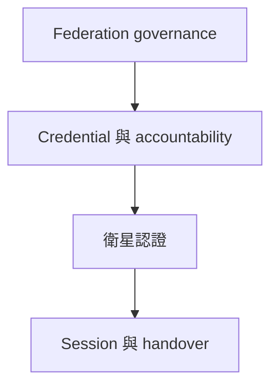

[English](ARCHITECTURE.md)

# 論文架構

## 範圍

本 repository 用於研究及實作後量子、隱私保護且可追責的衛星網路認證機制。PQ-RBBC 是完整系統中的一個密碼學模組，不等於整篇論文架構。

系統目標包括：

- 後量子認證與 session-key establishment；
- 具明確可連結性邊界的匿名、issuer-unlinkable 接入；
- 受門檻治理控制的 conditional identity opening；
- 降低衛星在線路徑的通訊量與驗證負擔；
- 在 serving context 改變時仍能抵抗 replay 並安全 handover；
- 清楚區分 specification、prototype 與已封閉實作 evidence 的 claim boundary。

## 系統分層

| 層級 | 責任 | 目前狀態 |
| --- | --- | --- |
| Federation governance | configuration、issuer authorization、opening authorization、獨立門檻金鑰 | 架構已定義；具體 DKG 與協定實作未完成 |
| Credential 與 accountability | PQ-RBBC issuance、compact ticket verification、trace binding、signature-gated threshold opening | 形式化核心與 executable relation 部分完成 |
| Satellite authentication | UE access、FGS verification、FLEO／LEO relay、freshness、anti-replay | 介面尚待定義 |
| Session 與 handover | PQ AKE、key confirmation、serving-context binding、roaming／handover continuity | 未完成 |

## 角色

| 角色 | 信任與責任 |
| --- | --- |
| UE／holder | 可能為惡意。註冊時向 HNCC 完成身分驗證、取得票券，之後在衛星在線路徑使用票券而不暴露註冊身分。 |
| HNCC | Honest-but-curious issuer。驗證註冊身分、執行共同 issuance policy 與 quota、驗證 augmented issuance relation，再回傳 blind-signing response；不得個人化 anonymity-set metadata。 |
| FAC members | Federation authorization authorities。使用獨立門檻金鑰系統授權 configuration 與 issuer operation；門檻 (t_F) 可與 opening threshold 不同。 |
| OA members | Opening authorities。持有獨立 threshold decryption shares，且只能透過 signature-gated API 釋出 share；門檻 (t_O) 可與 (t_F) 不同。 |
| FGS | 地面端 verifier 與 session endpoint。原則上負責較重的 policy verification、anti-replay state 與 session-key establishment，除非後續協定明確將已驗證的輕量子集交給 LEO。 |
| FLEO／LEO | 資源受限且不被預設為可信。只中繼或執行協定明確指定的輕量檢查；不得持有 issuer 或 opening secret keys。 |
| Operator | 定義共同 epoch、domain、policy、expiry bucket、serving context 與營運規則，並受 federation authentication 約束。 |

FAC 與 OA 可以由相同 organizations 營運，但其金鑰、threshold、ceremony、storage、rotation、compromise domain 與協定角色皆須獨立。

## 密碼學模組

### M1. Federation configuration 與 issuer authorization

驗證共同資訊：

$$
\mathsf{ci}=(\mathsf{version},\mathsf{epoch},\mathsf{domain},
\mathsf{policy},\mathsf{expiryBucket},\mathsf{kid}_{OA},
\mathsf{kid}_{I})
$$

以及 digest (\mathsf{ctx})。此模組必須防止 HNCC 在可見 metadata 中嵌入每位使用者專屬 watermark。具體 PQ threshold signature 與 DKG 尚未選定。

### M2. PQ-RBBC relation-bound blind ticket

目前可使用的票券為 (T=(M,\sigma))，其中：

$$
M=(\mathsf{ctx},\mathsf{sn},h,C).
$$

離線 issuance 在同一 augmented relation 中綁定 exact blind request、canonical ticket payload、holder secret、已驗證的 registered identity、serial number 及 threshold trace ciphertext。在線 verifier 只收到 fixed-format ticket 與 compact blind signature，不接收 issuance proof。

目前實作定義 (\mathsf{Setup})、relation-bound blind issuance、(\mathsf{VerifyTicket})、(\mathsf{OpenShare}) 與 threshold combination；尚未定義獨立、可 rerandomize 或 zero-knowledge 的 (\mathsf{Show}) protocol。因此重複出示同一張 ticket 仍可被連結，系統層必須決定 one-time 或 short-lived ticket lifecycle。

參見 [modules/rbbc/README_zh-TW.md](modules/rbbc/README_zh-TW.md)。

### M3. Opening authorization

產生並驗證一份綁定 ticket digest、case identifier、evidence digest、expiry 與 purpose 的 PQ authorization。它與 OA decryption key 獨立；FAC 如何依治理規則產生這份 authorization，仍是未完成的系統協定。

### M4. Signature-gated threshold opening

OA 只能暴露：

$$
\mathsf{OpenShare}(\mathsf{tsk}_i,Q),
\qquad Q=(T,E,\mathsf{caseID},\mathsf{auth}),
$$

不得提供對任意裸 ciphertext 直接 partial decrypt 的 API。只有在 ticket、context、authorization、purpose、expiry 及 replay 檢查全部通過後才能產生 share。Combiner 還必須確認解出的 serial 等於 ticket 明文 serial。Robust 且可公開稽核的 threshold-share transcript 尚未完成。

### M5. Satellite authentication 與 PQ AKE

輸入已驗證 ticket、verifier nonce 與 serving context，建立新鮮 session key。具體 KEM／signature composition、mutual-authentication transcript、channel binding 及 forward／backward secrecy games 尚未完成；本模組必須維持 FLEO／LEO 的低運算與低通訊負擔。

### M6. Anti-replay、revocation 與 handover

定義 one-time ticket consumption 或 nullifier state、revocation distribution、context transition、handover authorization、failure recovery 與 availability。這些功能不屬於 RBBC core。

## 協定階段

1. **System initialization：**建立獨立 FAC 與 OA keys、issuer keys、共同 configuration 與 public parameters。
2. **Issuer authorization：**由 (t_F)-of-(n) FAC 批准 HNCC 在限定 epoch、policy、quota 與 expiry 中發行。
3. **Enrollment and offline issuance：**HNCC 驗證 UE 身分；PQ-RBBC 綁定 hidden ticket、blind request、holder secret、registered identity、serial 與 trace ciphertext。
4. **Access authentication：**UE 提交 ticket 與 freshness／session data；指定 verifier 驗證 policy、context、signature、replay state 及 PQ AKE transcript。
5. **Handover／continuous authentication：**session 重新綁定新 serving context，不暴露 registered identity，也不在線呼叫 HNCC。
6. **Conditional opening：**有效 case authorization 控制 (t_O)-of-(n) OA shares、reconstruction、serial consistency、evidence generation 與 audit。
7. **Revocation and lifecycle：**散布並執行 expired、consumed、compromised 或 revoked credentials／keys。

目前只有第 3 階段的 cryptographic core 與第 6 階段的一部分被深入形式化；其他階段仍是論文級工作項目，不能視為已實作。

## 安全目標

- PQ unforgeability 與 request／message binding；
- 對 honest-but-curious HNCC 的 issuer unlinkability；
- 在明確 metadata 與 timing assumptions 下，對 satellite-path observers 的 anonymity；
- 明確的 one-time-ticket 或 presentation unlinkability semantics；
- mutual authentication 與 fresh session-key establishment；
- replay、impersonation、MITM 及 context-substitution resistance；
- trace soundness 與 holder non-frameability；
- 少於 (t_O) opening authorities 時的 privacy；
- authorization-gated、purpose-limited、replay-resistant opening；
- session 與 handover keys 的 forward／backward secrecy。

任何文件都不得因某個 RBBC circuit checkpoint 已封閉，就宣稱上述目標全部完成。

## 目前 claim boundary

最新合併 checkpoint 為 RBBC v2.25。Tree 0–7 已 materialize 並獨立 replay；tree 8–17、全部 72 relocations、完整 18-tree replay、parent CAP-to-(H_{RBBC}) join、fork-specific reductions、合格 PQ SE-NIZK backend、real trace key、robust opening transcript、satellite AKE、anti-replay 與 handover 仍未完成；production closure 為 false。
