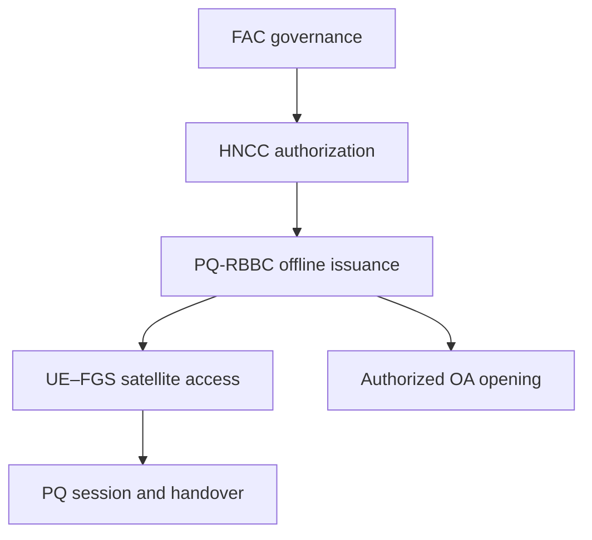

[繁體中文版](README_zh-TW.md)

# Post-quantum accountable satellite authentication

This repository is the research and implementation workspace for a complete
post-quantum, privacy-preserving, accountable satellite authentication
mechanism.

PQ-RBBC is the most mature cryptographic module in the repository. It is not
the entire thesis system. The project also includes federation authorization,
opening governance, satellite access and PQ authenticated key establishment,
anti-replay and revocation, handover, end-to-end security composition, and
satellite-path evaluation.

## Start here

1. [ARCHITECTURE.md](ARCHITECTURE.md) — system layers, roles, modules, phases,
   trust assumptions, and security boundaries.
2. [RESEARCH_STATUS.md](RESEARCH_STATUS.md) — what is defined, implemented,
   tested, proved, or still open.
3. [ROADMAP.md](ROADMAP.md) — whole-thesis work tracks, parallel lanes, and
   integration gates.
4. [modules/README.md](modules/README.md) — module registry and current path
   ownership.
5. [docs/roadmaps/PQ_RBBC_CURRENT_HANDOFF.md](docs/roadmaps/PQ_RBBC_CURRENT_HANDOFF.md)
   — operational handoff for ongoing RBBC tree work.

## Architecture at a glance



- FAC and OA may use the same federation-member organizations, but use
  independent threshold keys, ceremonies, and thresholds \(t_F\) and \(t_O\).
- HNCC is honest-but-curious and performs authenticated offline issuance.
- FLEO/LEO is resource-constrained and not inherently trusted.
- The satellite online path should carry only compact ticket and session data;
  large issuance proofs and threshold opening remain off that path.
- Opening shares are available only through a signature- and
  authorization-gated API.

## Repository layout

| Path | Purpose |
| --- | --- |
| `ARCHITECTURE.md` | canonical whole-system definition |
| `ROADMAP.md` | project-level implementation and proof roadmap |
| `RESEARCH_STATUS.md` | conservative whole-project claim boundary |
| `modules/` | module registry and migration-safe module entry points |
| `src/` | current RBBC Python reference/circuit implementation and satellite-access test-only primitives |
| `tests/` | current RBBC regression/mutation/replay tests and system reference tests |
| `manifests/` | frozen RBBC machine-readable evidence and claims |
| `artifacts/metadata/` | portable metadata for external RBBC artifacts |
| `docs/proof/` | RBBC formal-proof source and rendered releases |
| `docs/roadmaps/` | versioned RBBC roadmaps and operational handoff |
| `docs/releases/` | RBBC checkpoint release notes |
| `docs/artifacts/` | RBBC artifact reconstruction and evidence notes |
| `checksums/` | release checksum inventories |

The current paths are intentionally preserved during architecture migration so
ongoing RBBC tree-producer work and sealed artifact identities are not
disrupted.

## Current implementation checkpoint

Merged RBBC checkpoint v2.25 has materialized and independently replayed planned
tree positions 0 through 7 (8 of 18). Positions 8 through 17, all 72
relocations, complete 18-tree replay, cross-segment identity, parent join,
fork-specific reductions, qualified PQ proof backend, robust threshold
opening, satellite AKE, replay/revocation, and handover remain open.
`production_closed = false`.

## Running current RBBC tests

```bash
PYTHONPATH=src python -m unittest discover -s tests -v
```

Optional production replay tests require external assignments whose exact
identities and handling rules are recorded in the RBBC handoff and
[docs/ARTIFACT_POLICY.md](docs/ARTIFACT_POLICY.md). Never deserialize an
untrusted checkpoint or commit large assignment archives, pickle caches, resume
state, BR1CS archives, or split archive parts.
