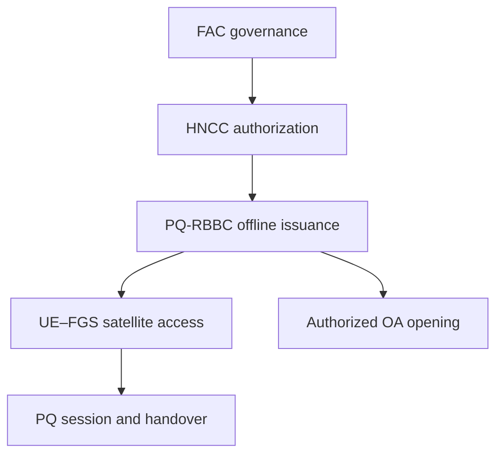

[繁體中文版](README_zh-TW.md)

# Post-quantum accountable satellite authentication

> For the current, mechanism-oriented repository map, start with the
> [Traditional Chinese guide](START_HERE_zh-TW.md). It separates day-to-day
> module entry points from long historical evidence filenames.

This repository is the research and implementation workspace for a complete
post-quantum, privacy-preserving, accountable satellite authentication
mechanism.

PQ-RBBC is the most mature cryptographic module in the repository. It is not
the entire thesis system. The project also includes federation authorization,
opening governance, satellite access and PQ authenticated key establishment,
anti-replay and revocation, handover, end-to-end security composition, and
satellite-path evaluation.

## Start here

1. [START_HERE_zh-TW.md](START_HERE_zh-TW.md) — current human-oriented map.
2. [modules/README_zh-TW.md](modules/README_zh-TW.md) — mechanism entry points.
3. [RESEARCH_STATUS_zh-TW.md](RESEARCH_STATUS_zh-TW.md) — canonical current claims.
4. [ARCHITECTURE_zh-TW.md](ARCHITECTURE_zh-TW.md) and
   [ROADMAP_zh-TW.md](ROADMAP_zh-TW.md) — canonical semantics and next gates.

## Architecture at a glance


```mermaid
flowchart TD
    A["FAC governance"] --> B["HNCC authorization"]
    B --> C["PQ-RBBC offline issuance"]
    C --> D["UE–FGS satellite access"]
    D --> E["PQ session and handover"]
    C --> F["Authorized OA opening"]
```

- FAC and OA may use the same federation-member organizations, but use
  independent threshold keys, ceremonies, and thresholds \(t_F\) and \(t_O\).
- HNCC is honest-but-curious and performs authenticated offline issuance.
- FLEO/LEO is resource-constrained and not inherently trusted.
- The satellite online path should carry only compact ticket and session data;
  large issuance proofs and threshold opening remain off that path.
- Opening shares are available only through a signature- and
  authorization-gated API.

## Repository layout

| Path | Purpose |
| --- | --- |
| `ARCHITECTURE.md` | canonical whole-system definition |
| `ROADMAP.md` | project-level implementation and proof roadmap |
| `RESEARCH_STATUS.md` | conservative whole-project claim boundary |
| `modules/` | module registry and migration-safe module entry points |
| `src/` | current RBBC Python reference/circuit implementation and satellite-access test-only primitives |
| `tests/` | current RBBC regression/mutation/replay tests and system reference tests |
| `manifests/` | frozen RBBC machine-readable evidence and claims |
| `artifacts/metadata/` | portable metadata for external RBBC artifacts |
| `docs/proof/` | RBBC formal-proof source and rendered releases |
| `docs/roadmaps/` | versioned RBBC roadmaps and operational handoff |
| `docs/releases/` | RBBC checkpoint release notes |
| `docs/artifacts/` | RBBC artifact reconstruction and evidence notes |
| `checksums/` | release checksum inventories |

The current paths are intentionally preserved during architecture migration so
ongoing RBBC tree-producer work and sealed artifact identities are not
disrupted.

## Current integration snapshot

The consolidated research branch contains the v2.43 PQ-RBBC reservation-binding
checkpoint, the bounded issuance chain through fresh-parent I1–I5 preflight,
satellite-access v0.2 reference processors and single-host durable state, system
governance checkpoints, opening integration, and isolated access/threshold
prototypes. Named independent human approval, qualified production PQ proof/AKE
backends, distributed deployment, and end-to-end proof closure remain open.
`production_closed = false`.

## Running current RBBC tests

```bash
PYTHONPATH=src python -m unittest discover -s tests -v
```

Optional production replay tests require external assignments whose exact
identities and handling rules are recorded in the RBBC handoff and
[docs/ARTIFACT_POLICY.md](docs/ARTIFACT_POLICY.md). Never deserialize an
untrusted checkpoint or commit large assignment archives, pickle caches, resume
state, BR1CS archives, or split archive parts.
