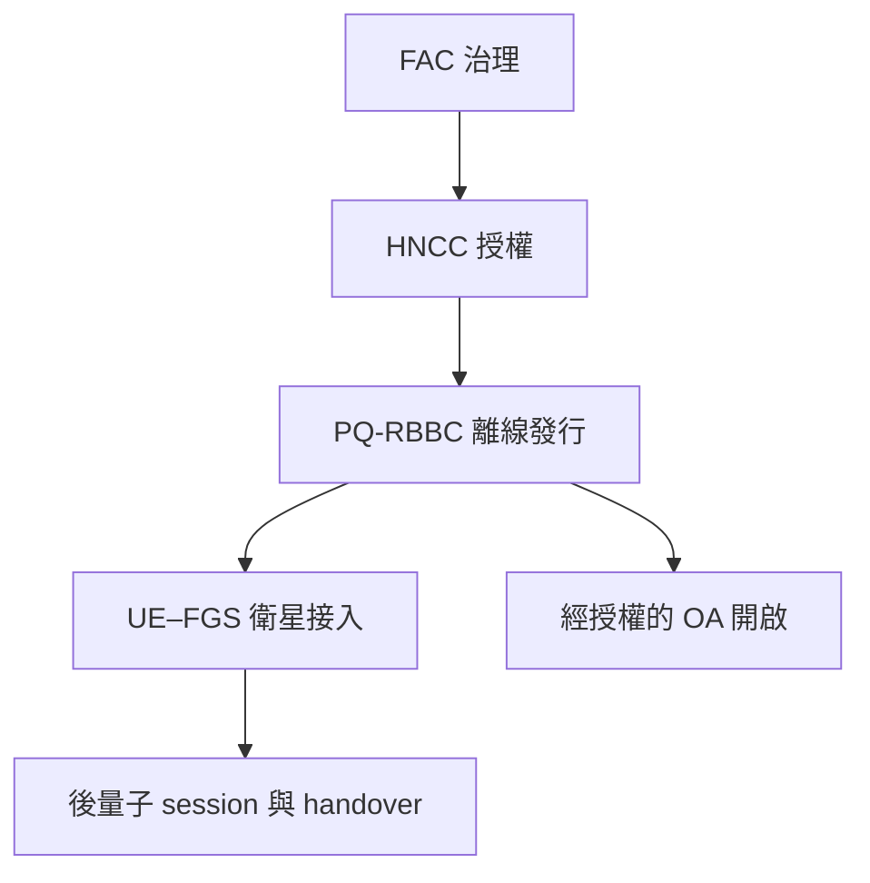

[English](README.md)

# 後量子可追責衛星認證

本 repository 是完整後量子、隱私保護且可追責之衛星認證機制的研究與實作工作區。

PQ-RBBC 是目前最成熟的密碼學模組，但不是整篇論文的全部。完整專案亦包含 federation authorization、opening governance、衛星接入與後量子認證金鑰建立、anti-replay、revocation、handover、端到端安全組合，以及衛星路徑效能評估。

## 建議閱讀順序

1. [research-notes.md](research-notes.md)、[methodology.md](methodology.md)、[experiments.md](experiments.md)、[thesis-outline.md](thesis-outline.md)：跨任務恢復研究脈絡、方法、實驗與寫作進度。
2. [docs/DOCUMENTATION_POLICY_zh-TW.md](docs/DOCUMENTATION_POLICY_zh-TW.md)：各文件的 canonical responsibility、更新與歷史保存規則。
3. [ARCHITECTURE_zh-TW.md](ARCHITECTURE_zh-TW.md)：系統分層、角色、模組、階段、信任假設及安全邊界。
4. [RESEARCH_STATUS_zh-TW.md](RESEARCH_STATUS_zh-TW.md)：哪些內容已定義、實作、測試或證明，以及仍未完成的項目。
5. [ROADMAP_zh-TW.md](ROADMAP_zh-TW.md)：整篇論文的工作線、可平行工作及整合 gates。
6. [modules/README_zh-TW.md](modules/README_zh-TW.md)：模組 registry 與目前路徑歸屬。
7. [docs/roadmaps/PQ_RBBC_CURRENT_HANDOFF_zh-TW.md](docs/roadmaps/PQ_RBBC_CURRENT_HANDOFF_zh-TW.md)：目前 RBBC tree 工作的操作交接文件。

## 架構概覽



- FAC 與 OA 可以由同一批 federation-member organizations 營運，但必須使用獨立門檻金鑰、產生程序及門檻 (t_F)、(t_O)。
- HNCC 採 honest-but-curious 假設，負責經身分驗證的離線發行。
- FLEO／LEO 資源受限，且不被預設為可信。
- 衛星在線路徑應只攜帶精簡票券與 session 資料；大型 issuance proof 與 threshold opening 不進入這條路徑。
- Opening share 只能透過同時受 signature 與 authorization 控制的 gated API 產生。

## Repository 結構

| 路徑 | 用途 |
| --- | --- |
| `ARCHITECTURE.md`／`ARCHITECTURE_zh-TW.md` | 完整系統的 canonical definition |
| `ROADMAP.md`／`ROADMAP_zh-TW.md` | 專案級實作與證明 roadmap |
| `RESEARCH_STATUS.md`／`RESEARCH_STATUS_zh-TW.md` | 保守的全專案 claim boundary |
| `modules/` | 模組 registry 與 migration-safe 入口 |
| `src/` | 目前 RBBC Python reference 與 circuit implementation |
| `tests/` | RBBC regression、mutation 與 replay tests |
| `manifests/` | 凍結的 RBBC machine-readable evidence 與 claims |
| `artifacts/metadata/` | 外部 RBBC artifacts 的 portable metadata |
| `docs/proof/` | RBBC 形式化證明原始檔與 release PDF |
| `docs/roadmaps/` | RBBC 版本化 roadmap 與操作交接 |
| `docs/releases/` | RBBC checkpoint release notes |
| `docs/artifacts/` | RBBC artifact 重建與 evidence 說明 |
| `checksums/` | release checksum inventories |

架構遷移期間刻意保留目前路徑，以免干擾正在進行的 RBBC tree producer 工作或改變 sealed artifact identities。

## 目前實作 checkpoint

已合併的 RBBC v2.25 已 materialize 並獨立 replay 規劃中的 tree 0–7（共 8／18）。Tree 8–17、全部 72 個 relocations、完整 18-tree replay、cross-segment identity、parent join、fork-specific reductions、合格的 PQ proof backend、robust threshold opening、satellite AKE、replay／revocation 及 handover 仍未完成；`production_closed = false`。

## 執行目前 RBBC 測試

```bash
PYTHONPATH=src python -m unittest discover -s tests -v
```

部分 production replay tests 需要外部 assignments；其精確 identities 與處理規則記錄於 RBBC handoff 及 [docs/ARTIFACT_POLICY.md](docs/ARTIFACT_POLICY.md)。不得反序列化不可信 checkpoint，也不得 commit 大型 assignment archives、pickle caches、resume state、BR1CS archives 或 split archive parts。
