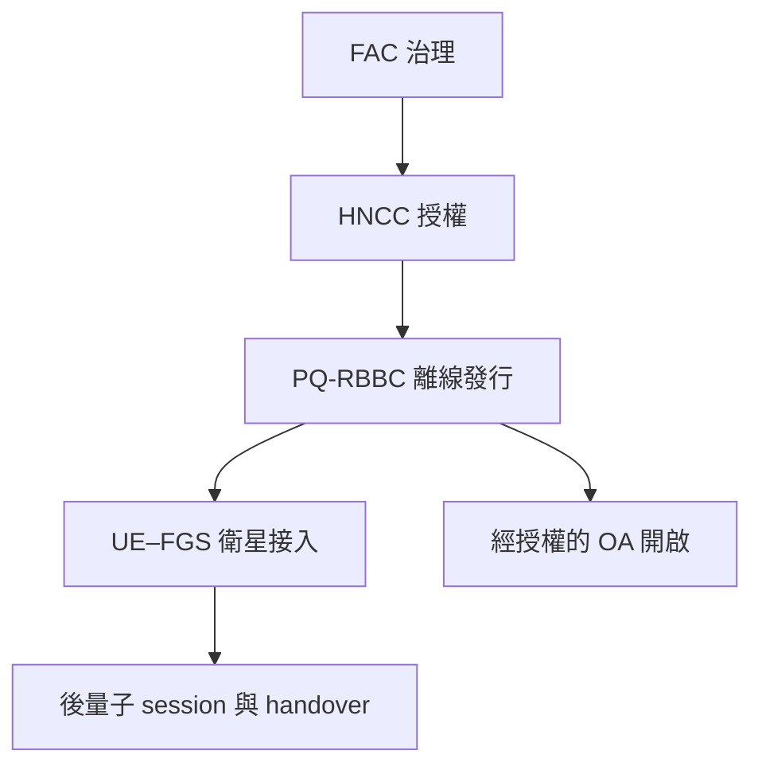

[English](README.md)

# 後量子可追責衛星認證

> **第一次進來請讀 [`START_HERE_zh-TW.md`](START_HERE_zh-TW.md)。**它把程式按
> System、Issuance、Access、Lifecycle、Opening、Threshold research 與 Evaluation
> 分成七個短入口；一般閱讀不需要先打開歷史 artifact 長檔名。

本 repository 是完整後量子、隱私保護且可追責之衛星認證機制的研究與實作工作區。

PQ-RBBC 是目前最成熟的密碼學模組，但不是整篇論文的全部。完整專案亦包含 federation authorization、opening governance、衛星接入與後量子認證金鑰建立、anti-replay、revocation、handover、端到端安全組合，以及衛星路徑效能評估。

## 建議閱讀順序

1. [START_HERE_zh-TW.md](START_HERE_zh-TW.md)：人類入口與七個機制。
2. [modules/README_zh-TW.md](modules/README_zh-TW.md)：每個機制的程式、測試與邊界。
3. [RESEARCH_STATUS_zh-TW.md](RESEARCH_STATUS_zh-TW.md)：全專案 canonical claim status。
4. [ARCHITECTURE_zh-TW.md](ARCHITECTURE_zh-TW.md) 與 [ROADMAP_zh-TW.md](ROADMAP_zh-TW.md)：正式語意與下一步。
5. [research-notes.md](research-notes.md)、[methodology.md](methodology.md)、[experiments.md](experiments.md)、[thesis-outline.md](thesis-outline.md)：跨任務研究工作台。

## 架構概覽


```mermaid
flowchart TD
    A["FAC 治理"] --> B["HNCC 授權"]
    B --> C["PQ-RBBC 離線發行"]
    C --> D["UE–FGS 衛星接入"]
    D --> E["後量子 session 與 handover"]
    C --> F["經授權的 OA 開啟"]
```

- FAC 與 OA 可以由同一批 federation-member organizations 營運，但必須使用獨立門檻金鑰、產生程序及門檻 (t_F)、(t_O)。
- HNCC 採 honest-but-curious 假設，負責經身分驗證的離線發行。
- FLEO／LEO 資源受限，且不被預設為可信。
- 衛星在線路徑應只攜帶精簡票券與 session 資料；大型 issuance proof 與 threshold opening 不進入這條路徑。
- Opening share 只能透過同時受 signature 與 authorization 控制的 gated API 產生。

## Repository 結構

| 路徑 | 用途 |
| --- | --- |
| `ARCHITECTURE.md`／`ARCHITECTURE_zh-TW.md` | 完整系統的 canonical definition |
| `ROADMAP.md`／`ROADMAP_zh-TW.md` | 專案級實作與證明 roadmap |
| `RESEARCH_STATUS.md`／`RESEARCH_STATUS_zh-TW.md` | 保守的全專案 claim boundary |
| `START_HERE_zh-TW.md` | 短入口；按 protocol 機制導覽 |
| `modules/` | 模組 registry 與 migration-safe 入口 |
| `src/` | 系統 package、PQ-RBBC evidence-coupled modules 與隔離 prototypes |
| `tests/` | 依 system／access／issuance／opening／threshold 分類的 regression evidence |
| `manifests/` | 凍結的 RBBC machine-readable evidence 與 claims |
| `artifacts/metadata/` | 外部 RBBC artifacts 的 portable metadata |
| `docs/proof/` | RBBC 形式化證明原始檔與 release PDF |
| `docs/guides/` | Protocol、實作與 evidence 之間的非 canonical 教學導覽 |
| `docs/roadmaps/` | RBBC 版本化 roadmap 與操作交接 |
| `docs/releases/` | RBBC checkpoint release notes |
| `docs/artifacts/` | RBBC artifact 重建與 evidence 說明 |
| `checksums/` | release checksum inventories |

架構遷移期間刻意保留目前路徑，以免干擾正在進行的 RBBC tree producer 工作或改變 sealed artifact identities。

## 目前整合快照

- PQ-RBBC CAP 線已至 v2.43 reservation-binding；real owner-controlled reservation 已有，
  但具名獨立 human review、launch manifest 與 production execution 仍未完成。
- Issuance 線已至 bounded fresh-parent I1–I5 CandidateSet preflight，尚未產生正式
  `pi_issue`。
- Satellite access v0.2 已有完整 reference processors、單主機 SQLite lifecycle 與
  reconciliation；真實 production PQ backend 與 distributed deployment仍未完成。
- ML-DSA／FAEST holder-signature candidates與threshold backends仍是隔離 research
  prototypes。整個 repository 的 `production_closed = false`。

## 執行目前 RBBC 測試

```bash
PYTHONPATH=src python -m unittest discover -s tests -v
```

部分 production replay tests 需要外部 assignments；其精確 identities 與處理規則記錄於 RBBC handoff 及 [docs/ARTIFACT_POLICY.md](docs/ARTIFACT_POLICY.md)。不得反序列化不可信 checkpoint，也不得 commit 大型 assignment archives、pickle caches、resume state、BR1CS archives 或 split archive parts。
