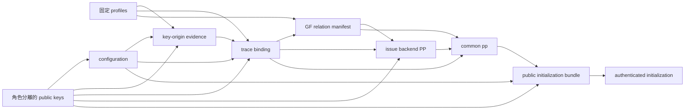

# GF authentication／key-origin／relation adapter 接合提案 v0.1

日期：2026-09-14。本輪從 `00ec5c66c0238e12b4f43b0a5842f529713a9c58` 接續。
本文件定義下一段接合工作的輸入、驗證順序、責任與驗收案例；**尚未成為 common／B／system
canonical contract，亦未獲其 owner 接納**。機器可讀要求在
[requirements_v0_1.json](requirements_v0_1.json)。這份 proposal 的 digest 與既有 wire ABI
fingerprint 分開，不改動 315／489／3005／251／4324-byte packets。

本輪新增的是可審查的 adapter 契約與文件一致性檢查，沒有 authentication、certificate、
GF native relation 或 Prove／Verify 成功路徑。既有 codecs／binding checks 的實作與
[同作者複核](../codecs_review_v0_1/REVIEW_zh-TW.md) 保留原有範圍。

## 1. 核對到的具體相依項目

| 現有邊界 | 原始碼支持的能力 | 接上 GF 尚缺什麼 |
| --- | --- | --- |
| System `verify_initialization` | 驗 canonical envelope、帶外 role-1 key reference、完整 bundle authentication message；backend exception／非精確 True 拒絕 | 合格 signature backend、verification key bytes 的可信解析、service 持有的 trust policy |
| T research checker | 外部 research pin 下，完整 pp／key／configuration／opaque inputs 的 bytes equality | 可信 pin 的來源、key-origin evidence verifier、B qualification |
| B `ProductionIssuanceCommonParametersV1` | 固定 NIED profile／ABI／relation／key certification identities | 新 GF backend PP 與 GF full-relation manifest，不能套用舊 NIED parser |
| B `CAPToHRBBCAdapterV1` | reduced profile 實算 CAP／H_RBBC，要求 r 等於 CAP-derived mask | legacy18 production execution 仍在大型計算前拒絕；本輪不啟動它 |
| B `evaluate_relation` | test-only NIED evaluator，I3 使用 hash-shape adapter | GF witness evaluator、完整 native I1–I5、witness-free proof verifier |
| Ticket／opening | 固定 368-byte NIED M；payload／transport identities 有別 | GF M dispatch、trusted h／AD view、版本化 case identity |

精確 revisions、bytes／SHA-256 與行號見 [來源索引](source_index_v0_1.json)。其他工作線
僅讀取已提交來源；沒有 import 其 worktree 程式執行，也沒有修改其 files。

兩個不可省略的接合細節：

- System 的 authentication message 是 `b"PQ-RBBC/SYSTEM-INIT-AUTH/V1" + bundle.encode()`。
  只驗 configuration、ctx 或 pp hash 都不能取代對完整 bundle 的 authentication。
- 在核對的 CAP implementation 中，rho 導出 commitment **及 r**。僅驗
  `beta = r XOR H_RBBC(d_M, c_r)` 而未約束 `r = CAP(rho).derived_mask`，仍缺少 I3 接合。
  `r` 與 `beta` 任意 72-byte 值可以通過 codec，並不表示存在符合 relation 的 rho。

## 2. 用途與信任起點

Frozen GF ABI 的 `purpose=1` 表示 **non-threshold full-key research reference**。
此提案服務於該研究 profile 的後續接合；即使將來有真實設定簽章或 key-origin evidence，
也不能把它直接改成 production／DKG／threshold profile。Production 呼叫仍必須在 backend
與秘密輸入處理前 unavailable；若要改用途，需另立 profile／ABI 並重新核對適用性。

服務啟動時由部署／研究 harness 的可信設定提供 verification key resolver、允許的 exact
backend／profile identities 及 key-origin policy。Request 不得提供替換 backend、trust anchor
或 `verified=True` 的途徑。Python callback 回傳 True 僅是抽象介面結果；未具體化、審查的
callback／test verifier 不會因包上一層 adapter 而取得密碼學可信性。

所有外部 bytes 只 capture 一次，先限制型別／長度，再用同一 immutable bytes hash、strict
parse 與驗證。不得先檢查 pathname 再重開檔案，也不得將 `ResearchBindingMatch` 或 caller
建構的 `InitializationVerification` 當作服務入口的 credential。

## 3. Adapter 邊界

以下名稱是 **semantic operations**，不是新 wire protocol、已註冊 Python API 或已完成 verifier。

### S-AUTH — AuthenticateInitialization（system owner）

- Request input：canonical authenticated initialization envelope bytes。
- Service inputs：帶外 role-1 configuration key reference、匹配其 digest 的實際 verification
  key bytes、service-selected signature backend 與 profile policy。
- 必須核對：envelope／bundle canonical encoding、角色分離、advertised key 與帶外 key 相等；
  以固定 authentication domain 驗完整 bundle。Backend exception、False、1 或其他 truthy
  value 皆不能成功；沿用 canonical `valid is True` 契約。
- Internal output：同一 captured bundle／envelope identities 與已解析 bundle，連同本次
  service policy identity；只供後續 stages 使用，不是 caller 可序列化的通行 token。
- 目前缺口：具體 PQ authentication scheme／key resolution／qualification。既有
  `DigestTestVerifier` 是 deterministic fixture，不能成為此 operation 的真實正例。

### T-ORIGIN — VerifyKeyOrigin（T＋system owners）

Expected tuple 必須來自 S-AUTH 的 bundle、strict pp／key bytes 與 service policy：
`(abi_sha256, crypto_profile_sha256, configuration_sha256, ctx, epoch, oa_role=5,
purpose=1, oa_key_id, tpk_record_sha256, origin_model_id, certifier_policy_id)`。

Evidence artifact 必須有 exact size／digest、versioned canonical codec、domain-separated
authentication／proof statement，以及與上述 expected tuple 的逐欄一致性。Verifier 必須實際
驗證其來源與所選 key-generation 模型要求；parser success、issuer 字串或 JSON claim 不足。
Certifier 的權限從 service policy 解析，不能使用 evidence 自報的 key 自行驗證；本提案也
**沒有擅自指定 FAC configuration key 就是 key-origin certifier**。

Evidence codec、signing domain、origin model 的生成正確性／bad-key 要求、certifier authorization
尚未選定，故不在此製造 certificate bytes 或證明。它們必須在實作 verifier 前由 owner 交付。
Full-key research origin 不能被解讀為 DKG；不得輸出 secret key、KeyGen seed 或 shares 作為公開
evidence。未知 origin model、wrong epoch／purpose／profile 或不具權限的 certifier 必須拒絕。

### B-QUAL — QualifyGFRelationInputs（B owner）

輸入為已選定 pp／key／binding，加上 exact backend PP 與 GF full-relation manifest bytes。
除了 pp 中的 digest equality，還要核對 backend namespace、setup／verification key identity、
GF ABI／crypto／CAP／H_RBBC profiles、全 relation 的來源／artifact identities、public/private
partition，以及該 backend 需要的 qualification evidence。Canonical sources 沒有指定合格
backend；本提案不自選一個 scheme 或捏造其 proof／setup bytes。

舊 NIED common parameters／manifest、test hash-shape I3、reduced CAP、unified-tree evidence
都不能只改名稱後供 frozen legacy18 GF ABI 接受。後兩者若要使用，需要自己的版本與證據。
完整 native relation 必須交付下列 same-wire／ordinary-constraint obligations：

| Join ID | 必須使用同一份值／wires |
| --- | --- |
| J01 | M header pp、statement pp 與已選定完整 common pp SHA-256 |
| J02 | M.ctx、statement.ctx、已驗 configuration 的 ctx |
| J03 | 對完整 3005-byte M（含 ABI／pp header）計算 I2 d_M |
| J04 | rho 的 CAP computation 輸出 r，與 witness r 相等 |
| J05 | 同一 CAP commitment c_r 及 J03 d_M 進 H_RBBC；同一 r 與 public beta 形成 XOR equation |
| J06 | `SHAKE256("PQ-RBBC/HOLD" || k_hold,32)` 等於同一 M.h |
| J07 | I5 AD 恰為同一 M.ctx／M.sn／M.h；plaintext 為 statement.rid／同一 M.sn |
| J08 | 全部 c1–c4 由同一 canonical tpk／u128 及固定 GF hash domains 計算並逐一比較 |

Host evaluator 必須與 native constraint evaluator 分開交付；前者的 True 不替代後者或 proof。
未知、缺少或不合格 backend 在 CAP tree execution／proving／opening 前拒絕。

### B-EVAL／B-VERIFY — 私密 evaluator 與公開 verifier 分離

| Operation | 允許的 caller inputs | 結果的用途 |
| --- | --- | --- |
| EvaluateGFIssuanceResearch | common pp、canonical tpk、statement251、witness4324 | 本機研究 relation diagnostic；不稱 VerifyIssue 或 trusted accept |
| VerifyGFIssue | public common pp、statement251、backend-defined proof bytes | 只有合格 backend 與已解析 service context 才可能完成 proof verification；本輪 OPEN |

Witness 不得為驗證方便而額外出現在 VerifyGFIssue：M／sn／h／C／d_M／rho／u／k_hold 都不應
加入其 public statement、per-ticket pp 或 proof header。Internal receipt 也不能被 caller 自行
序列化再送回繞過前置檢查。Issuer 的 rid／sid 認證、quota 與 replay 屬於其原有系統流程。

## 4. 生成相依圖與接受順序

下列箭頭代表生成 prerequisites／內含 identities，**不表示新增現有 codec 欄位**：



本 proposal 選擇 relation manifest 與 backend PP 可綁 **trace binding** 的 identity，再由
common pp 綁其 digest；這須 B owner 接納。兩者不得反向 hash 最終 common pp／bundle。
Native circuit 若需檢查 M.pp，應把 public pp identity 作為受約束的 public parameter/input
與 M header 比對；不能要求先將含自己 digest 的最終 pp 烘入 artifact 再求 artifact digest。
Key-origin evidence 也不得反向 hash 最終 pp、bundle 或自己。Post-build review 若需引用完整
pp，可放在不被 pp 反向 hash 的獨立紀錄；這不自動滿足 qualification。

所有 setup artifacts 都是 anonymity-set 共用資料。若將 sid／rid／M／sn／h／C／d_M／u 等
per-ticket input 納入圖中，應拒絕設計，避免把 private metadata 放進共同 pp。

**接受順序不同於生成順序**：purpose gate → bounded capture → S-AUTH → strict byte bindings
→ T-ORIGIN → B-QUAL → B-EVAL 或 B-VERIFY。先 authenticating 含完整 pp digest 的 bundle，
再檢查其依賴，不會造成生成的 hash cycle。失敗只產生安全的 stage／code，不附 secret bytes；
下游 key-origin、relation、CAP、proof 或 threshold backend touch counts 必須維持預期的零值。

## 5. 待 owner 實作的驗收案例

以下都是 **驗收義務，尚未執行實際 adapter／cryptographic tests**。本輪文件 checker 另列，
不得將其通過數量填到這張表。

| ID | 刺激 | 要求結果／觀測 |
| --- | --- | --- |
| TA01 | 完整 canonical research setup、真正合格 providers 與匹配 inputs | 最多進入研究 evaluator；此 ABI 的 production 仍 unavailable |
| TA02 | request 自帶 anchor／verifier／accepted receipt，或完全重簽一份 attacker bundle | 拒絕 override；固定 service anchor 下不能自行建立信任 |
| TA03 | 只簽 config／ctx／pp hash；bundle 內其他角色或 policy 被換 | S-AUTH 拒絕；origin／B touch=0 |
| TA04 | signature invalid／backend exception／回傳 1 | S-AUTH 拒絕；origin／B touch=0 |
| TA05 | 驗證後重開同一路徑換 bytes，或 mutable input | Capture／identity 邊界拒絕；不得混用 hash 與 consume 的 inputs |
| TA06 | u=0，跨 key I5 成立；同時替換 supplied key 與自報 digest | 與 authenticated bundle／完整 pp 不符即拒絕；B touch=0 |
| TA07 | evidence parse 合法但 signer/model/profile/epoch/purpose/key identity 不符 | T-ORIGIN 拒絕；B touch=0 |
| TA08 | evidence 僅有 verified=true、偽造 KeyGen／DKG claim | 無適用的實際 verifier／model 就拒絕；B touch=0 |
| TA09 | backend PP／manifest digest 正確，但仍是 NIED 或不合格 CAP profile | B-QUAL 拒絕；CAP／prover touch=0 |
| TA10 | r／beta／rho 全部 codec 合法，但 r 不等於 CAP-derived mask | J04 native constraint 拒絕；不能靠替換 beta 修復缺少的約束 |
| TA11 | duplicated pp／ctx／sn／h／rid／u wire 只更改一份 | J01–J08 對應普通 constraints 拒絕；逐項列出 row／wire evidence |
| TA12 | M header 改變、I2 卻只 hash 尾端；或 c2/c3/c4 mutation | J03／J08 拒絕；host equality 不能替代 circuit evidence |
| TA13 | VerifyGFIssue 要求 witness、public pp 含 per-ticket metadata | API／partition 檢查拒絕，不能先取得秘密再回報未使用 |
| TA14 | manifest/backend PP/key-origin 反向引用最終 pp 或 envelope | 建立前的 dependency 檢查拒絕 cycle；不得以 placeholder digest 補洞 |
| TA15 | 相同歷史 lookup identity 指向兩組不同 pp/key 或 revoked policy | System resolver 拒絕歧義；historical opening policy 由 system 另定 |
| TA16 | 缺少任一 provider／qualification，或切 production／threshold 用途 | 下游計算前 unavailable；不得用 fixture、full secret key 或布林旗標替代 |

## 6. 交付與下一個可實作範圍

T 已交付現有 codecs／research mismatch checks 與本提案。S-AUTH provider、T-ORIGIN 的模型／
codec／verifier、B-QUAL／B-EVAL／B-VERIFY、ticket／opening adapters 的 owner acceptance 均
維持 OPEN；本文件不是其簽名或核准。

下一個 T 範圍內可獨立實作的項目是 **GF partial issuance witness evaluator**：重用 frozen
codecs 與 I5 reference，檢查可直接計算的 pp／ctx／I2／I4／I5，明列 I3、authentication、
key-origin 與 native proof 缺口；整體不得回傳 full-relation accept。這能先提供 B 所需的
可重現 wire/input mutation cases，且不需要呼叫未交付的 provider 或大型 CAP。

原則、設計理由與驗收要求由本文件供 integration owner 登錄 methodology／experiments／
RESEARCH_STATUS；本分支不改寫那些共享文件。實際檢查命令、計數、digest 與 claim boundary
見 [validation_summary_v0_1.json](validation_summary_v0_1.json)。

## 7. 本輪執行的檢查

```bash
PYTHONDONTWRITEBYTECODE=1 python docs/literature/threshold_backends/gf/trusted_adapter_contract_v0_1/check_contract_v0_1.py
PYTHONDONTWRITEBYTECODE=1 PYTHONPATH=src python -m unittest discover -s tests/threshold_candidates -v
PYTHONDONTWRITEBYTECODE=1 PYTHONPATH=src python -m unittest discover -s tests/system_modules/governance -p test_system_init.py -v
git diff --check
```

| 檢查 | 結果與範圍 |
| --- | --- |
| Proposal document checker | 3 個正例通過、30 個變異拒絕、5 個 malformed JSON 拒絕；包含 cycle、partition、role／purpose、claim promotion |
| Threshold regression | 90 passed、0 failed/errors、0 skipped；12.794 s |
| Canonical system initialization regression | 15 passed、0 failed/errors、0 skipped；0.002 s；沿用 test-only signature fixture |
| Source identities | 19 份 canonical／研究政策檔、5 份附件及被引用的 4 份前輪複核來源重核吻合；本輪另索引 15 份來源 |

文件 checker 只驗選定的格式／相依／partition invariants；J01–J08 的文字不是 executable
constraints，TA01–TA16 也未因此成為通過的 adapter tests。它不 import 專案 backend，不接收
certificate／proof／witness，不輸出 cryptographic acceptance。

Proposal fingerprint 是 canonical compact JSON 的 SHA-256：
`bbb395352135c4c079895bd035fb1e38999793f5604bb0899dcbbdbd0fb41359`。
它不取代 frozen GF wire ABI fingerprint，也不是 pretty JSON 檔案的 digest。
本輪只新增文件與獨立 document checker，`src/`、`tests/` 與 frozen ABI 沒有改動；未重跑
全量 baseline。先前 766 passed／0 failed/errors／12 skipped 的 full run 仍是歷史結果，
不是本輪重新執行。Raw logs／PDF／下載資料及大型或秘密輸入均未加入 Git。
