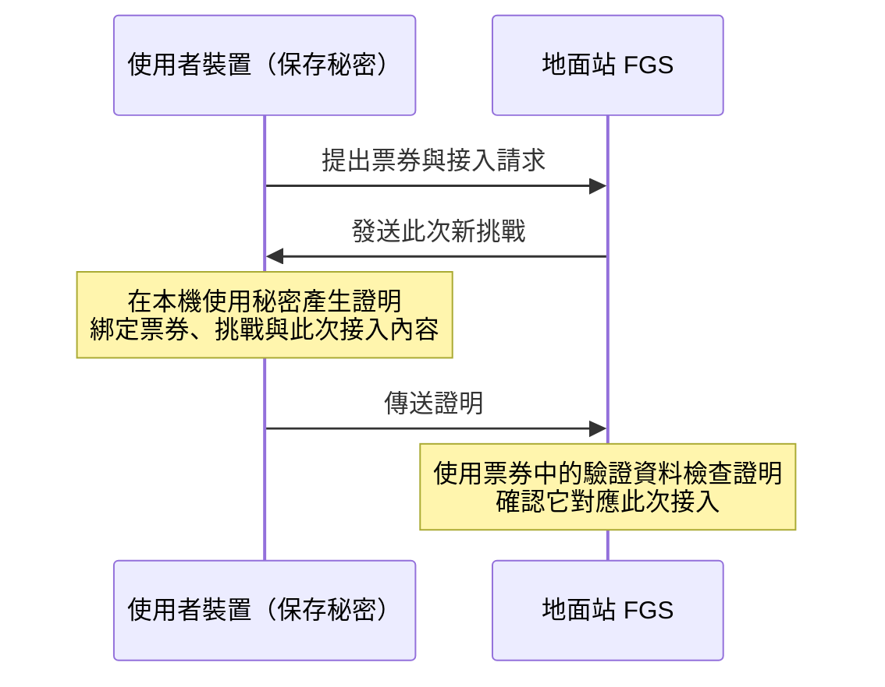

# 第二堂：票券有效，為什麼還要驗證持票者？

日期：2026-09-13。所屬：[學習路線](../ROADMAP_zh-TW.md) 階段 2，必要安全概念的起點。
先備：[第一堂](01_RESEARCH_PROBLEM_zh-TW.md) 的研究問題與基本邊界。
本堂完成條件：能區分格式、票券有效性、持票者證明與服務授權，並說明複製有效票券的風險。

本堂先理解每種檢查負責什麼，再於後續課程學金鑰、雜湊與簽章的運作。
完整持票者認證方案仍待選定與實作；以下是本專案的需求與概念例子。

## 格式正確，表示資料可以被解讀

第一堂最後討論有人亂填資料冒充票券。若缺少欄位、長度不對或版本不符，格式檢查就應拒絕。
但攻擊者也可以照公開規格填好每個欄位，仍填入偽造內容。

「格式檢查／解析」先回答：程式能否依約定解讀這份資料？
例如一個假設的欄位規定是 16 bytes，填入恰好 16 bytes 只能滿足長度要求，不能證明內容有效。

因此，一份資料可能格式正確，但無法通過後續的密碼學有效性檢查。
本例不改動實際票券編碼，也不根據猜測估計各階段會拒絕多少請求。

## 票券有效，仍需要另外驗證當下出示者

假設小明依正式流程取得一張有效票券 `T`。小華得到 `T` 的完整副本，但沒有小明的持票者秘密。
這裡只設定資料被複製的情境，不假設任何實際部署都會公開傳輸票券。
為了專注比較這兩種檢查，假設票券未過期、未被消耗，申請服務也在授權範圍內。

```text
小明持有：票券 T ＋ 與 T 綁定的持票者秘密
小華持有：票券 T 的完整副本
```

副本的每個位元組都和原本相同。因此，只檢查票券本身的函式，不會因為資料現在由小華出示，
就看到不同的票券內容。若票券簽章原本有效，完整複製本身也沒有改動那個簽章。

「簽章」先理解為可供驗證資料是否得到對應簽署金鑰持有者簽署的密碼學資料。
本專案的票券簽章與發行流程有關；它不自動證明現在拿出票券的人掌握持票者秘密。
簽章也不單獨保證任何敘述都真實，還要看簽署前執行了哪些檢查與採用什麼信任假設。

## 持票者秘密是另一項資料

本專案要求使用者證明自己掌握與票券綁定的 `holder secret`。
先把它理解成裝置保存的秘密資料；票券包含的是與秘密綁定的值，不能把秘密本身當成公開欄位送出。
具體如何產生和驗證這個證明，仍須選定安全的機制，後續再介紹相關工具。

| 資料 | 主要用途 | 本課要分清楚的地方 |
| --- | --- | --- |
| 票券 `T` | 提供可驗證的票券內容與簽章 | 能複製票券資料，不代表能證明知道其綁定秘密 |
| 持票者秘密 | 讓使用者支持此次接入的持票者證明 | 由使用者端保護；驗證端應驗證證明，不要求直接公開這份秘密 |
| 開啟端的秘密份額 | 支持有授權的門檻身分開啟 | 屬於開啟權責成員，與持票者秘密的角色不同 |

持票者秘密證明關乎「此次請求者能否證明憑證持有關係」；票券中的追責資料關乎
「符合開啟條件時能否恢復發行時綁定的註冊身分」。兩項用途不能混為一談。

## 如果票券與秘密一起被複製

學習者主動提問：「另外這部分我有問題 與票券綁定的秘密一起被複製走怎麼辦 通常都會一起複製走吧」。

如果小華取得有效票券 `T`，也取得可使用的相應持票者秘密，他就能用同一份秘密產生新的
持票者證明。只依靠這項秘密的認證機制，無法分辨小明與小華。票券仍然有效，問題是憑證遭竊；
不能期待格式或票券簽章檢查拒絕這份完整副本。

「能證明掌握秘密」不等於「能證明操作裝置的自然人就是原持有人」。
若原持有人主動分享可複製的票券與秘密，也有相同限制；綁定秘密本身不保證不可轉讓。

是否會一起被複製，要先說明攻擊者能讀取什麼，不能只根據「兩者都在使用者端」判斷。

| 攻擊者取得的資料或能力 | 對持票者認證的影響 |
| --- | --- |
| 只有票券副本或網路上交換的訊息 | 安全的認證協定應避免訊息洩漏秘密，並防止舊證明直接重用；這是需求，完整實作尚未完成 |
| 能讀取同一儲存區內以可讀形式保存的票券與秘密 | 兩者都可能被複製，學習者的疑慮成立；分成兩個檔案但維持相同讀取權限，不能解決這種攻擊 |
| 能控制正在執行的使用者程式或裝置 | 可能讀取記憶體內的秘密，或操控裝置代做認證；不能只靠「秘密不在網路上傳送」保護 |

這裡的「端點」是保存秘密並執行協定的裝置或服務；使用者手機、電腦就是使用者端點。
威脅模型草稿 **P-A12** 假設誠實端點的秘密不因記憶體洩漏、惡意軟體等原因外洩。
草稿也把裝置遺失／實體擷取防護列在目前 profile proof scope 之外。
這是尚未涵蓋的安全邊界，不是秘密永遠不會外洩的證明。

### 可以考慮的保護方式與代價

以下是說明取捨的候選方向，不表示專案已選定或完成這些功能。

- **減少秘密可被讀取的地方。** 保護儲存權限，避免秘密進入日誌與未受保護的備份。
  加密保存可保護部分離線檔案複製情境，但仍取決於解密金鑰如何保存；若執行中的程式已被
  控制，解密後的秘密仍可能外洩。加密與復原也需要額外的金鑰管理。
- **讓受保護的金鑰只能在裝置內運算。** 例如 Android Keystore 提供不可匯出金鑰的機制，
  並能限制金鑰用途或要求本機使用者驗證；官方文件也明列，被攻陷的程式仍可能使用金鑰。
  因此「不能把金鑰複製出去」與「不能盜用裝置上的金鑰」是兩個問題。
  硬體保護還取決於裝置及演算法支援；本專案 holder authenticator 尚未選定，不能假設目前
  的持票者秘密證明可以直接在該硬體內完成。參見
  [Android Keystore 官方文件](https://developer.android.com/privacy-and-security/keystore)。
- **處理失竊後的憑證。** 撤銷是讓原本有效的票券或金鑰不再被接受；它需要驗證端取得並
  執行有效的撤銷資訊。重新取得新秘密與新票券，不會自動讓舊票券失效。短效票券能縮短
  外洩後的可用期間，但不能代替撤銷，也不能補救已經發生的使用；撤銷傳播與可用性另有成本。

一次性使用也有不同責任：即使完整的持票者認證與使用狀態機成立，最多只能限制同一票券
成功建立一次初始連線，不能保證小明先取得那次機會；小華可能先消耗票券。
同樣地，對這張失竊票券執行有授權的身分開啟，恢復的是票券綁定的註冊身分，
不能單憑這項結果證明當時實際操作的人就是該身分本人。

目前教材基線尚無完整 holder authenticator、使用者票券管理程式或撤銷實作。
本次補課只釐清需求、假設與可考慮的設計方向，沒有新增裝置失竊防護宣稱。

## 每種檢查各自回答什麼

| 檢查 | 要回答的問題 |
| --- | --- |
| 格式檢查 | 能否按約定的版本、欄位與長度解讀？ |
| 票券有效性檢查 | 票券能否通過指定的密碼學驗證？ |
| 持票者認證 | 此次請求者能否證明掌握票券所綁定的秘密？ |
| 服務授權 | 此時、此服務範圍是否允許這個請求？ |

這是責任分類，不是完整接入檢查順序；實際流程還包含效期、撤銷、此次交握的綁定與使用狀態等。
接入驗證要求多項條件共同成立，不能把單一檢查通過當成整個接入成功。

## 秘密留在裝置內，地面站怎麼驗證

正常協定要求持票者秘密留在使用者端，裝置用它產生可供地面站驗證的證明。
驗證端使用票券中與秘密綁定的驗證資料，檢查收到的證明；不需要取得秘密本身。
「不傳送秘密」與「任何運算結果都安全」不能畫上等號：所選機制仍須保護秘密，
並避免沒有秘密的人偽造有效回應。這裡先學雙方需要交換什麼，不自行發明證明演算法。

只驗證一份固定證明，仍不足以確認新的接入。假設某人先前確實產生了有效證明，
旁觀者把那份資料記錄下來，以後原封不動送出；若驗證規則只檢查相同資料，
就沒有據此區分新請求與舊紀錄。本例只分析認證檢查，不假設票券使用狀態檢查已被繞過。

### 目前接入草稿的例子，不是所有持票者證明的必要流程

教學更正：前一版由「證明能被複製」直接接到地面站發挑戰，容易讓人誤以為證明掌握秘密
一定需要這種互動。非互動式證明不需要驗證者現場送出證明挑戰；以下僅對應目前 v0.1
接入草稿的 FGS challenge，不能當成 NIZK 的內部流程或最終方案已定案的依據。

目前 v0.1 接入草稿要求地面站提供此次的新挑戰值，持票者認證須綁定此次接入內容。
這裡的「挑戰值」可先理解成地面站這次出的新題目；草稿的 FGS nonce 要求不可預測且不重複。
它不是密碼，可以傳給使用者；不能只回傳或複製挑戰值就算認證成功。



這是概念流程，省略其他接入訊息與檢查，不是完整 wire protocol，也不表示驗證證明後
就能直接接受服務。教材基線已定義相關欄位，但完整 holder authenticator 仍待選定與實作。

例如上一次挑戰記作 `A`，對應證明記作 `P_A`；新嘗試的挑戰記作 `B`。
`A`、`B` 是不同挑戰的代號，不是實際要使用的短字串參數。
安全的綁定機制應使舊證明 `P_A` 無法直接成為對 `B` 的有效回應；地面站必須以
目前這次接入的預期內容驗證，不能讓提交者任選一份舊挑戰作為驗證依據。

## NIZK、Fiat–Shamir 與接入往返數

### 先回答「我現在做的東西有使用 NIZK 嗎」

學習者追問：「我不太清楚 意思是我現在時做的東西不是使用NIZK 嗎」。
先前說明一次混入發行、接入、Fiat–Shamir 與未完成狀態，沒有先清楚回答這個基本問題。

**論文核心設計有使用 NIZK；目前這個學習分支所對照的程式，尚未完成該 NIZK 的完整
證明產生與驗證流程。** 已有大量工作是在建立 NIZK 要證明的規則，以及承載這些規則的電路。

| 層次 | 白話意思 | 目前對照結果 |
| --- | --- | --- |
| 設計採用 NIZK | 發行時，使用者應用一份非互動式零知識證明，讓發行端確認規定的關係成立 | 核心論文明確定義 `pi_issue`，已有這項設計 |
| 實作要證明的規則 | 把票券、秘密與追責資料必須滿足的關係寫成可執行檢查，並轉成許多小運算與約束，也就是這裡所說的電路 | 已完成大量相關實作與局部驗證，細節仍依各 checkpoint 區分 |
| 產生並驗證真正的 NIZK | 產生可交給驗證者的證明，讓驗證者不用取得秘密也能檢查 | 合格的 PQ NIZK 證明引擎及完整流程仍未完成 |

例如 [verify_relation()](../../src/pq_rbbc_reference.py) 接收 `statement` 與 `witness`；
`witness` 裡包含 `holder_key` 等秘密資料，供本機開發時直接檢查規則。
這不表示正常協定要把秘密送給地面站，也不等於已完成零知識驗證。
以下僅是資料流示意，不是專案已存在的完整 API：

```text
本機規則檢查：公開資料 ＋ 秘密資料 → 檢查規則是否成立

目標中的 NIZK：
使用者端：公開資料 ＋ 秘密資料 → 產生證明
驗證者端：公開資料 ＋ 證明     → 驗證，不取得秘密
```

對照依據為 [核心 proof 的 issuance NIZK 定義](../../docs/proof/source/pq_rbbc_sgtd_core_proof_v1.tex)、
[實作導覽 §5.3](../../docs/guides/PROTOCOL_TO_IMPLEMENTATION_GUIDE_zh-TW.md) 的規則／電路與證明引擎分工，
以及 [研究狀態](../../RESEARCH_STATUS_zh-TW.md)。不能因本機規則檢查通過，就寫成 NIZK 已完成。

這份發行 NIZK 與「拿到票券後，接入地面站時如何驗證持票者」是兩個階段。
後者的完整認證方案仍待選定；前一段地面站出題的草稿例子，不表示核心發行設計取消 NIZK。
本次先釐清設計與實作進度，不追加新的挑戰值或防重放測驗。

### 證明的非互動性與接入往返數

學習者提醒：「我記得不適這樣吧 應該是使用NIZK 直接產生挑戰值 避免兩次來回傳送」。
這個提醒正確指出非互動式證明可以省去證明階段的現場問答；不能據此推定目前在線接入
已選定 NIZK 或整個連線建立只需一趟往返。

NIZK 是 non-interactive zero-knowledge，非互動式零知識證明。共同參數等前提就緒後，
證明者可產生證明交給驗證者，不必為了證明本身等待驗證者即時出題；零知識則涉及
驗證過程不額外洩漏秘密的性質。兩者是不同面向。

Fiat–Shamir 是把合適的互動式證明轉為非互動式的一種方法，不是所有 NIZK 的同義詞。
它以協定規定的 hash 計算證明內部的 challenge；驗證者能依相同資料重算。
Hash 先理解成把資料轉成摘要的函式，相同輸入會得到相同輸出。
挑戰不能由證明者任選；算得出挑戰也不等於能在不知道秘密時產生有效證明。
這裡僅引用 [RFC 8235 §2.3](https://www.rfc-editor.org/rfc/rfc8235.html#section-2.3)
說明轉換概念，不採用該文的 Schnorr 演算法作為本專案方案，也不據此宣稱後量子安全。

| 比較 | 證明內部的 Fiat–Shamir challenge | 目前接入草稿的 FGS nonce |
| --- | --- | --- |
| 如何取得 | 依規定對公開敘述、證明前段資料與情境等內容計算 hash | 地面站產生並透過 `AccessChallengeV1` 傳送 |
| 主要責任 | 在合適的證明系統中取代驗證者現場提供的證明挑戰 | 與接入內容綁定，區分草稿中的不同接入嘗試 |
| 能否直接互換 | 不能只把 hash 值換進 nonce 欄位就當成完成協定修改 | 即使內部證明非互動，外層協定仍可能要求這個訊息 |

NIZK 不會自動讓舊證明失效。若公開敘述、情境與證明全部照抄，驗證者仍可能接受
同一份數學證明；「證明有效」與「這是新的、獲准的接入」是不同的判斷。
如何保護一次性使用、連線金鑰與本次授權，仍需要系統狀態及完整接入協定；不能僅靠
使用者自行換隨機數或加入時間戳就宣稱完成。RFC 8235 §6 也要求依使用情境分析 replay。

### 核對這份專案的結果

- **離線發行：**核心 proof 明確定義 `pi_issue` 為 NIZK，用於發行 relation。
  [架構 M2](../../ARCHITECTURE_zh-TW.md) 明列在線驗證端不接收這份 issuance proof；
  最終票券簽章內的 CAP proof 是另一個物件，不能和 `pi_issue` 混為一談。
- **在線接入草稿：**[狀態規格 §5](../../docs/specs/ONE_TIME_TICKET_STATE_v0_1_zh-TW.md)
  列出 `Init → Challenge → Finish → Accept` 四則訊息，包含 `fgs_nonce`。
- **現有程式：**[access.py](../../src/pq_sat_auth/access.py) 定義上述訊息的編碼與接入摘要；
  `holder_authenticator` 仍是待解讀的 bytes 欄位。依
  [研究狀態](../../RESEARCH_STATUS_zh-TW.md)，沒有完整 holder authenticator 或 PQ AKE。
- **導覽待釐清：**[協定導覽 §6](../../docs/guides/PROTOCOL_TO_IMPLEMENTATION_GUIDE_zh-TW.md)
  的兩則訊息概念圖未說明如何對應上述四則訊息及認證時序，不能用它聲稱已完成單往返接入。
  最終往返數與低延遲方案須隨 D-002 的認證／金鑰建立設計釐清；本次只記錄教學疑點，
  沒有修改 canonical 設計或把四則訊息刪成兩則。

## 證明還要綁定此次請求

如果某份持票者證明可以原封不動地用在任何時候或任何地面站，取得舊資料的人就可能重送。
所以本專案還要求證明綁定此次接入的交換內容，而不是只確認某人曾經產生過一份證明。
「交換內容」包含雙方訊息與本次服務環境；正式欄位之後在流程與實作課程介紹。
在目前接入草稿中，除了地面站的新挑戰，還要求綁定票券、地面站身分與服務環境等內容。
「綁定」在本課的意思是：更換這些受保護內容後，原證明不能直接通過驗證。
只附加一個隨機數欄位而沒有把它納入認證、或沒有核對它是不是此次預期值，並不能防止重用。
這也不單獨保證抵抗所有即時轉送攻擊；完整連線協定與其他綁定條件後續再學。

這也說明「證明掌握秘密」與「驗證一次性使用狀態」各有用途：前者處理誰能授權此次請求，
後者限制同一票券能成功建立幾個初始連線。

## 理解檢查

先回答第一題，再依需要逐步處理其餘題目。

1. 小華只有小明有效票券的完整副本，沒有相應持票者秘密。地面站能否只因票券驗證成功就允許小華接入？還缺哪項驗證？
2. 資料符合欄位與長度規定，但簽章驗證失敗，這是哪一層拒絕？
3. 為什麼不能直接把持票者秘密放進每次接入訊息，讓地面站比較？
4. 為什麼持票者認證還需要綁定接入內容？NIZK 驗證成功，是否就代表這份接入請求沒有被重送？原先 `A`／`B` 挑戰題只作草稿流程的選用練習，不要求以它回答所有 NIZK 情境。

這些問題用來檢查概念，不要求設計新的密碼學演算法。第二堂不執行程式修改或實驗。

## 對照來源與目前限制

- [ONE_TIME_TICKET_STATE_v0_1_zh-TW.md](../../docs/specs/ONE_TIME_TICKET_STATE_v0_1_zh-TW.md)：§2 的持票者秘密要求與 §6.3 的接入檢查。
- [ARCHITECTURE_zh-TW.md](../../ARCHITECTURE_zh-TW.md)：M2、M5、M6 的責任。
- [RESEARCH_STATUS_zh-TW.md](../../RESEARCH_STATUS_zh-TW.md)：教材基線仍無完整 holder authenticator 或 PQ AKE；現有 codecs 與測試不等於認證安全已完成。
- [端到端安全模型草稿](../../docs/security/END_TO_END_SECURITY_GAMES_DRAFT_zh-TW.md)：§4 P-A12 的端點秘密假設、§9 的撤銷待辦與裝置遺失／實體擷取的範圍限制；草稿不取代 canonical status，也不是端到端證明。
- [RBBC core proof 原始碼](../../docs/proof/source/pq_rbbc_sgtd_core_proof_v1.tex)：Simulation-extractable NIZK argument of knowledge 與 Correct backend separation 段落，區分離線 issuance NIZK 及最終簽章中的 CAP proof。

本堂對照的研究基線仍為 `6f6d8c832c0f90d69d96ffe3abd0dcc8b8c562bb` 所含 v2.42 整合狀態。
目前學習分支只有教學文件變更；之後進入實作時重新核對當時版本。
