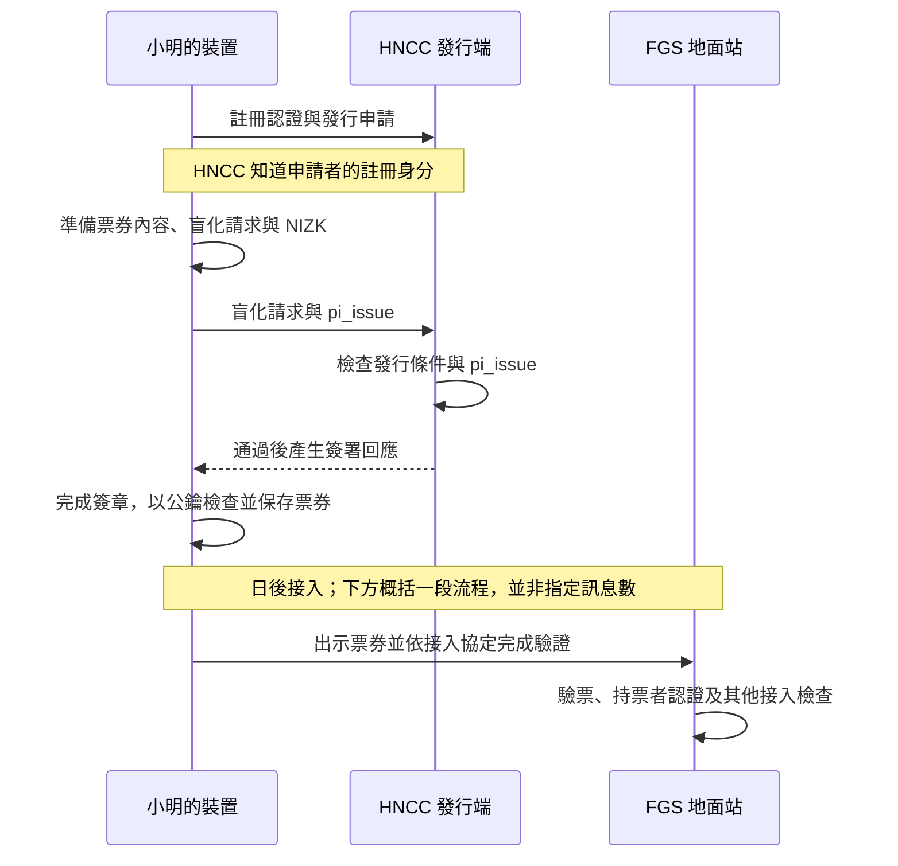

# 第四堂：盲發行如何兼顧隱私與合法性

日期：2026-09-14。所屬階段：2／必要安全概念。
接續 [第三堂](03_SIGNATURE_KEYS_zh-TW.md) 的簽署私鑰與驗證公鑰，沿用小明申請票券的情境。
本堂先理解發行流程與設計理由；不要求先讀懂 Blind-UOV 的運算公式。

## 為什麼現在學這件事

上一堂說明地面站如何用公鑰驗證票券簽章。現在要補上票券從哪裡來，以及發行時如何
保護後續使用隱私。這一步將第一堂的「不可連結性」接到實際設計工具。

假設小明向 HNCC 證明註冊身分，直接交出完整票券內容請它簽署。HNCC 就有機會保存
「小明 → 這張票券」的對照；日後取得地面站看到的票券，便可比對使用紀錄。
即使票券表面沒有姓名，發行階段留下的對照仍會暴露關係。

本專案核心設計採用盲發行：使用者把待簽內容經過規定的隨機化處理，形成隱藏內容的
簽署請求；發行者參與簽署後，使用者利用本機保留的資料完成最終簽章。
安全目標是在指定假設內，讓發行者無法從自己的發行紀錄辨認後來出示的票券屬於哪次發行。

## 小明取得一張票券的完整過程

### 1. HNCC 先確認小明可以申請

小明透過註冊認證程序向 HNCC 申請。HNCC 知道這次申請的註冊身分，並檢查發行期間、
額度等條件。這些條件不全是 NIZK 的工作；一般發行管理仍然需要執行。

### 2. 小明的裝置在本機準備票券內容

裝置產生新的票券序號、持票者秘密及所需隨機資料，組成票券內容：

- 對應本次發行的共同設定，例如適用的政策背景。
- 票券序號。
- 從持票者秘密算出的摘要；秘密本身留在裝置內。
- 追責用的加密資料，其中綁定此次已認證的註冊身分與票券序號。

「加密資料」在這裡表示平常不能直接讀出其中的身分；後續依開啟機制處理。
具體加密計算與門檻合併留待後面的課程。本步尚未得到可使用的完整票券，因為還缺簽章。

### 3. 小明送出盲化請求及 NIZK

**盲化**是依盲簽章方案，以隨機資料處理待簽內容，建立隱藏內容的請求。裝置保存
後續完成簽章所需的本機資料，向 HNCC 送出盲化請求及發行證明 `pi_issue`。

HNCC 看不到完整票券，仍然需要防止小明提交不符合規則的內容。NIZK 在這裡要證明：

> 我知道這個請求所對應的隱藏票券與秘密資料；它們共同符合你規定的發行關係。

對照核心 I1–I5，這些關係涵蓋票券格式與共同設定、內容摘要、請求與該摘要的對應、
持票者秘密的摘要綁定，以及追責密文對本次已認證身分與同一張票券的綁定。
證明必須指向**這次收到的請求與同一份隱藏內容**；這是先前學過的「綁定」在完整流程中的用途。

HNCC 用公開輸入與證明檢查這些關係，不需要取得完整票券或持票者秘密。
這裡的「公開」是相對於此次發行的驗證者 HNCC；其中包含它已認證的註冊身分。

### 4. HNCC 檢查通過後，產生簽署回應

HNCC 檢查身分、期間、額度、發行重放狀態及 `pi_issue`。只有接受後，才以自己的
簽署私鑰執行 `BlindUOV.Respond`，把回應交給小明。

因此，盲發行同時需要隱藏內容與驗證規則：前者保護發行與使用的對應，後者約束可被簽署的內容。

### 5. 小明完成並檢查簽章

小明的裝置使用回應及保留的隨機資料執行 `BlindUOV.Finalize`，取得最終簽章，
再用發行者公鑰驗證。接受後保存：

```text
可使用的票券 T = 票券內容 M + 最終簽章 sigma
```

持票者秘密另由裝置保護。發行請求、`pi_issue`、註冊身分與發行 session 識別值，
都不作為額外欄位隨 T 出示；票券內仍有綁定身分的追責密文。

### 6. 日後向 FGS 地面站申請接入

小明向 FGS 出示票券，並按接入協定完成其他驗證。FGS 可以看到票券內容及簽章，
重算摘要並用公鑰驗證；它不需要取得發行階段的 `pi_issue`。
持票者認證、服務條件及一次性使用等檢查仍有各自責任，接入細節在後續單元展開。



## 三項工具各負責什麼

| 工具 | 在這段流程中的責任 |
| --- | --- |
| 盲簽章／盲發行 | 隱藏待簽內容，並以發行紀錄與最終票券不可連結為安全目標 |
| 發行 NIZK `pi_issue` | 讓 HNCC 檢查隱藏票券、秘密及此次請求共同符合發行規則 |
| 最終票券簽章 | 讓小明與 FGS 能用發行者公鑰檢查票券簽章有效性 |

這個取捨的代價是發行過程需要盲化、證明產生與驗證、以及簽章完成等計算。
設計把 `pi_issue` 的檢查放在發行階段；日後的票券驗證透過最終簽章進行。
最終簽章中的其他底層證明與 `pi_issue` 不同，不能從這個分工推論所有證明計算都已移離接入路徑。

## 正式定義與目前實作的界線

- 以上依核心構造說明目標流程。目前已有 research relation 與大量電路實作；完整合格的
  NIZK 證明產生／驗證及 Blind-UOV 發行整合尚未完成，不把本堂流程圖視為可直接運行的成果。
- 核心票券驗證不直接重驗隱藏發行見證；追責資料正確性的結論還依賴發行證明、安全假設，
  以及發行者只在證明通過後簽署。
- 對 HNCC 的不可連結性是在誠實執行協定但會分析紀錄的發行者、相同共同資訊、誠實持票者、
  開啟端受控制份額少於門檻等模型條件下討論。流量、時間等外部線索不在此保證內。
- 同一張票券再次出示仍可被辨認；這個核心沒有獨立的可重隨機化 Show。

## 對照來源與下一步

- [核心定義](../../docs/proof/source/pq_rbbc_sgtd_core_proof_v1.tex)：
  Ticket format and issuance relation、Blind relation-bound issuance、Ticket verification；
  分別對照 I1–I5、`Respond`／`Finalize` 與最終票券 T。
- [Protocol 到實作導覽](../../docs/guides/PROTOCOL_TO_IMPLEMENTATION_GUIDE_zh-TW.md)：§5.3–5.4，
  發行 NIZK 的規則與工程層次、簽署回應及最終簽章的分工。
- [架構](../../ARCHITECTURE_zh-TW.md) 與 [研究狀態](../../RESEARCH_STATUS_zh-TW.md)：
  系統假設、接入責任與目前未完成項目。

下一段沿用票券內容，說明為什麼同時需要「持票者秘密的摘要」與「追責用的加密資料」，
由用途補足雜湊和加密的差別，再接回匿名性與受控追責。
