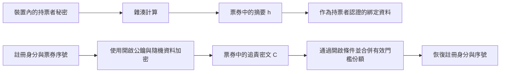

# 第五堂：持票者摘要與追責密文

日期：2026-09-14。所屬階段：2／必要安全概念。
接續 [第四堂](04_BLIND_ISSUANCE_zh-TW.md)，沿用小明申請、使用票券的完整情境。
本堂先從用途理解雜湊與加密，尚未進入 library 或逐行程式操作。

## 這堂課在路線中的位置

上一堂看到裝置在本機準備票券。這次要能解釋其中兩個欄位為什麼存在：

| 票券欄位 | 從什麼資料產生 | 本設計需要它支持什麼 |
| --- | --- | --- |
| 持票者摘要 `h` | 小明裝置內的持票者秘密 `k_hold` | 指定持票者認證應證明掌握哪個摘要所對應的秘密 |
| 追責密文 `C` | 註冊身分、票券序號及加密所需資料 | 平常隱藏身分；符合開啟條件時，恢復票券綁定的註冊身分 |

FGS 接入驗證與 OA 身分開啟負責不同事情，因此需要不同資料與權限。
OA 是開啟單位；第一堂已介紹其多人門檻與授權限制。

## 1. 雜湊：從秘密算出摘要

小明的裝置先產生難以猜中的隨機秘密，再依指定函式計算：

```text
h = H_hold(k_hold)
```

`k_hold` 是裝置保存的持票者秘密；`H_hold` 是此用途的雜湊函式；`h` 是結果，稱為摘要。
固定函式、設定與輸出長度後，相同輸入會得到相同摘要。

密碼學雜湊的一項要求，是給定摘要後，要找到能產生該摘要的輸入，在計算上應不可行。
這是安全性要求，不是宣稱沒有任何相符輸入，也不是保證每個摘要都只有唯一對應輸入。
參考 [NIST 的 preimage resistance 定義](https://csrc.nist.gov/glossary/term/preimage_resistance)。

本設計不提供用某把解密金鑰把 `h` 還原成 `k_hold` 的功能。也因此，秘密必須難猜：
如果候選只有幾個，觀察者仍可把每個候選送進同一雜湊函式，再拿結果比對。

票券中放 `h`，裝置保留 `k_hold`。後續持票者認證要讓裝置證明掌握相應秘密，並綁定
此次接入內容。**只看到 `h` 或能把 `h` 傳回來，不等於證明掌握秘密。**
本堂是在說明這項需求；實際 holder authenticator 仍待選定與完成。

## 2. 加密：保留有條件恢復原資料的能力

加密把要保護的資料變成密文；原本的資料稱為明文。相應的解密程序使用所需金鑰資料，
恢復明文。參考 [NIST 的 encryption 定義](https://csrc.nist.gov/glossary/term/encryption)。

小明的追責密文加密的是「註冊身分與這張票券的序號」。裝置使用開啟系統的公鑰及新取樣的
隨機資料建立密文，同時按核心規則綁定共同設定和持票者摘要。
開啟公鑰用來加密，與 HNCC 簽署私鑰、簽章驗證公鑰各有不同用途。

在指定安全假設下，FGS 看到密文不能直接讀出身分。合法的開啟流程則先檢查票券、案件授權
與其他條件，再由足夠的 OA 提供有效解密份額，合併恢復註冊身分與序號，並核對序號。

**密文的明文不包含 `k_hold`。** 開啟得到的是票券綁定的註冊身分，沒有從這個解密步驟
取回持票者秘密；也不能單憑該身分判定裝置失竊後的實際操作者。
授權檢查約束誠實開啟端；隱私仍依賴攻擊者合計取得的份額少於門檻，沿用第一堂的界線。

## 3. 沿著小明的票券看兩條資料路徑



這是兩項資料用途的圖，沒有把箭頭當成實際網路訊息，也沒有指定持票者證明演算法。
`h` 與 `C` 在盲發行時同屬隱藏票券內容；日後出示票券時，FGS 才會看到它們。

沿完整情境看：小明先在裝置內準備秘密、摘要與密文，透過上一堂的盲發行取得簽章；
一般接入使用票券與持票者認證；有符合條件的案件時，開啟流程才處理追責密文。
發行 NIZK 綁定兩條路徑屬於同一張票券、同一次已認證申請，最終簽章保護這份票券內容。

## 4. 為什麼不只留下其中一項

- 如果只保留目前的持票者摘要 `h`，它本身沒有提供受控恢復註冊身分的資料路徑。
- 如果只保留追責密文 `C`，持票者與觀察者都能複製它；出示密文本身不能證明此次請求者
  掌握裝置秘密。本設計透過 `h` 指定秘密綁定，再要求持票者認證。

這是在解釋本方案的分工，不是宣稱其他密碼學方案都必須使用相同欄位。
兩項功能同時保留的代價，是增加票券資料量、發行證明需要檢查的關係，以及開啟金鑰管理工作。

也不能把「身分取雜湊」直接當成匿名處理：若每張票券放入同一個身分的固定摘要，
觀察者仍可按相同值連結紀錄；若有候選身分清單，也可能逐一雜湊比對。
這是依雜湊確定性與第一堂連結目標作的情境推演。

本專案的 `h` 來自每張票券新產生的持票者秘密。小明取得另一張票券時，會重新產生秘密、
序號與所需隨機資料，再完成發行。這項安排避免刻意重用固定持票者摘要；它本身不保證
整套流程不可連結，也不能讓同一張票券反覆出示時變得不可辨認。

## 對照目前實作與下一步

- [核心定義](../../docs/proof/source/pq_rbbc_sgtd_core_proof_v1.tex)：Ticket format and issuance
  relation 的 `h`、`C` 與 I4／I5；Signature-gated threshold opening 的恢復內容與序號檢查。
- [reference model](../../src/pq_rbbc_reference.py)：`_derive_trace()` 先算 `holder_hash`，
  再建立追責資料；`rid + sn` 是受保護的身分與序號。`verify_relation()` 用完整輸入檢查
  這些關係，是本機研究檢查器，並非只取得公開資料的 NIZK 驗證端。
- [接入規格](../../docs/specs/ONE_TIME_TICKET_STATE_v0_1_zh-TW.md) §2：持票者認證需要綁定
  `h` 與完整接入內容；[研究狀態](../../RESEARCH_STATUS_zh-TW.md) 保留實際認證與 production
  threshold opening 尚未完成的界線。

下一堂補充「隨機數」：沿小明申請兩張票券，分辨新的持票者秘密、序號與加密隨機資料
各自的用途。仍先用完整例子，不追加連續符號測驗。
