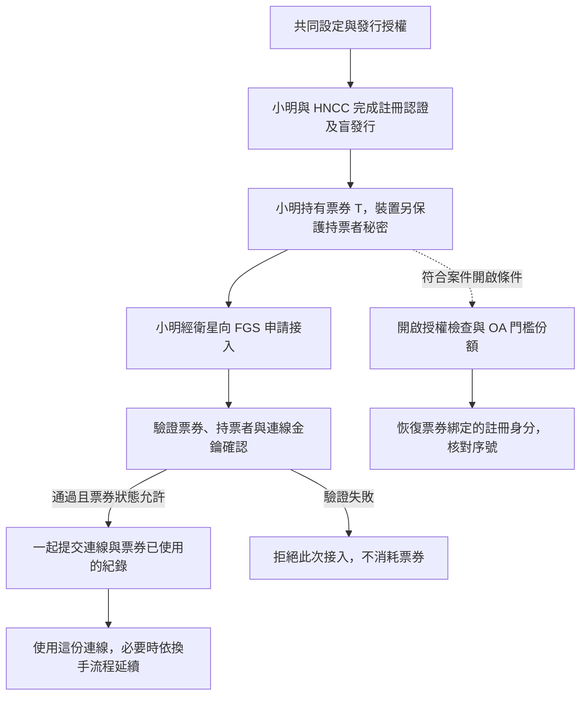

# 第八堂：一張票券的完整生命週期

日期：2026-09-14。所屬學習階段：3／完整系統流程。
接續 [第七堂](07_POST_QUANTUM_zh-TW.md)，把前面學過的工具放回小明申請與使用服務的情境。
本堂看全貌，之後逐段深入。這是設計與草稿的教學導覽，並非已完成端到端系統的操作展示。

## 這個階段要建立什麼能力

沿著一張票券，能指出每一步由誰處理、交換什麼資料、執行哪些檢查，以及下一步需要
前一步的什麼結果。這些問題之後會直接對應到程式的輸入、輸出、拒絕條件與狀態。

## 先把角色放好

| 角色 | 本堂的白話責任 |
| --- | --- |
| 小明的裝置（UE／holder） | 申請票券、保護持票者秘密，之後申請接入並參與連線金鑰建立 |
| HNCC 發行端 | 認證註冊身分，檢查發行條件與 NIZK，產生盲簽署回應 |
| FGS 地面站 | 驗票、驗持票者與服務條件，管理票券使用狀態，作為連線端點 |
| LEO／FLEO 衛星 | 中繼接入通訊，或執行協定指定的輕量檢查；不預設可信 |
| FAC 聯盟授權單位 | 依門檻機制認可共同設定與 HNCC 的發行權限 |
| OA 開啟單位 | 通過案件與票券等檢查後，依門檻機制參與身分開啟 |
| Operator 營運端 | 定義共同政策、有效期間與服務環境等營運設定，受聯盟認證約束 |

FAC 與 OA 即使由相同組織營運，金鑰、門檻與職責仍須分開；這是前面權限分離的具體位置。
衛星不持有發行簽署私鑰或身分開啟秘密份額。

## 完整流程圖

箭頭表示階段與資料的關係，不表示精確網路訊息數。有效期間與撤銷規則會約束接入等操作。
開啟是獨立分支，不是每次接入的必經步驟，也不以票券已成功使用為一律必要的前提。
圖中的拒絕分支只說明驗證失敗；並行搶用、保存失敗及重試的細節按接入規格處理。

## 1. 使用者申請之前：先知道哪些設定可信

各方先取得可驗證的共同設定，例如發行者驗證公鑰、開啟公鑰、適用期間與服務政策。
FAC 授權 HNCC 在指定條件與額度內發行。這解答第三堂留下的問題：FGS 憑什麼相信
手上的公鑰確實屬於獲准的發行者。

共同設定不能被 HNCC 任意改成每位使用者獨有的可見標記，否則即使盲簽章本身保密，
日後仍可能從標記連結使用者。設定的產生、認證與更新在下一堂展開。

## 2. 小明申請並保存票券

小明向 HNCC 完成註冊認證。裝置產生新秘密、序號與所需隨機資料，建立摘要及追責密文，
再送出盲化請求與發行 NIZK。HNCC 檢查身分、發行條件與證明後，回傳簽署回應。
裝置完成簽章並自行驗證，得到 `T = (M, sigma)`。

這時小明已取得票券，還沒有因此建立衛星接入連線。裝置另行保存並保護 `k_hold`。
HNCC 知道是小明申請，但在相應安全假設內，不能從發行紀錄辨認日後出示的票券。

「離線發行」表示發行不放在每次接入的即時路徑；申請時仍要和 HNCC 通訊。

## 3. 日後接入：小明經衛星找 FGS

需要使用服務時，小明的裝置經衛星與 FGS 交換接入資料。接入使用票券與該次連線所需的
資料，不需要 HNCC 再認證一次註冊身分，也不向 FGS 傳送發行時的 `pi_issue`。

本堂先把接入視為一段完整程序。具體草稿有 `AccessInit`、`AccessChallenge`、
`AccessFinish`、`AccessAccept` 四種訊息；它們已有編解碼實作，持票者認證與 PQ AKE
仍未完成。先前記錄的導覽兩訊息概念圖與四訊息草稿對應疑點保留，這張總覽不替它決定往返數。

FGS 必須核對票券格式與簽章、共同設定與服務條件、有效期間和撤銷資訊，以及持票者秘密
證明與此次接入的綁定。裝置與 FGS 也要完成連線金鑰建立及相應確認。
具體檢查順序依 [接入規格](../../docs/specs/ONE_TIME_TICKET_STATE_v0_1_zh-TW.md) §6.3。

## 4. 成功接入：票券使用狀態與連線一起確認

檢查通過且狀態允許後，系統才能提交這次成功連線，並把票券記為已使用。
「一起」的意思是系統不能留下已建立有效連線、票券卻又能被當成未使用的結果；
當多個請求同時競爭同一張票券，也最多只能有一個建立新的初始連線。

「消耗票券」指保存使用狀態，不是讓數位票券本身消失。規格要求：

- 驗證失敗不消耗票券。
- 成功提交後，該票券不能再建立另一份初始連線。
- 若成功回覆遺失，符合綁定條件的同一次嘗試重送，可取回原結果，不建立第二份連線。

`VerifyTicket` 只作不保存使用歷史的票券檢查；一次性使用還依賴持票者認證與一致的狀態保存。
這是設計要求，目前只有測試用途的單程序狀態模型，尚非完整耐故障、跨地面站的部署。

## 5. 連線期間、換手與失效

一份 session 是這次建立並由雙方維護的連線狀態。session key 是保護這份連線通訊的秘密
金鑰，由選定的連線協定建立，與持票者秘密各有用途，不能從公開票券直接當作秘密取得。

一次性票券限制的是成功建立初始連線的次數；後續通訊使用該連線狀態與金鑰，並不表示
每個資料封包都要重新發行票券。FGS 能知道同一份連線內的活動屬於這份連線；不可連結性
不等於隱藏同一 session 的所有關聯。

當服務環境改變而需要換手時，草稿要求使用綁定原 session 與新服務環境的授權；無法依此
完成時，須用尚未使用的新票券重新接入，不能重用已消耗票券。具體 handover 尚未實作。

過期或撤銷的票券不得建立新連線。已建立連線是否立即終止，還取決於 session 的有效期間
與撤銷政策；不能只看原票券的狀態就任意推論。細節留待生命週期單元。

## 6. 符合案件條件時，另外走身分開啟

案件程序提供票券、證據及相應授權。OA 先驗證票券、設定、授權用途與期限等條件，
通過後才產生有效的開啟份額。合併足夠份額後，恢復註冊身分及序號，並核對序號。

這個程序不恢復持票者秘密，也不保證從任意亂造的無效票券找到真實身分。
它支持的是受控恢復票券綁定的身分；實際案件判斷仍需要證據，包含裝置或秘密失竊等情境。
授權與少於門檻份額的隱私假設仍沿用第一堂說明。

## 各方看得到什麼

| 對象／時點 | 本堂需要追蹤的資料 | 不能據此直接推論的事情 |
| --- | --- | --- |
| 小明的裝置 | 自己的身分、票券、持票者秘密及發行見證；接入後的連線狀態 | 本機保存不保證裝置遭控制後仍安全 |
| HNCC 發行時 | 已認證身分、共同設定、發行 session、盲化請求與 NIZK | 不能把本機 relation checker 取得完整見證誤當成 HNCC 的協定輸入 |
| FGS 接入時 | 票券內容與簽章、接入資料及使用／連線狀態 | 驗票不直接解密追責身分；也不代表看不到同一票券或連線的關聯 |
| 衛星中繼時 | 經過的訊息資料與可觀察流量，具體可讀內容受通道設計影響 | 中繼角色不自動帶來機密性；不宣稱衛星完全看不到票券或無流量線索 |
| OA 開啟時 | 案件請求、票券與各自份額；合格合併程序可恢復綁定身分 | 單一未達門檻者不因有份額就獲得任意開啟能力 |

不同票券的隱私仍受共同資訊、端點、時間與流量等假設限制；本堂總覽不擴大既有安全宣稱。

## 後續讀程式的位置

| 流程 | 程式入口 | 目前閱讀時的界線 |
| --- | --- | --- |
| 設定與發行授權 | [system_init.py](../../src/pq_rbbc/governance/system_init.py)、[issuer_authorization.py](../../src/pq_rbbc/governance/issuer_authorization.py) | 已有資料認證介面與有限範圍管理流程，完整 production 密碼學與部署未完成 |
| 票券發行關係 | [pq_rbbc_reference.py](../../src/pq_rbbc_reference.py) | 可核對秘密與公開資料的關係，不是完整盲發行或 NIZK 系統 |
| 接入資料與使用狀態 | [access.py](../../src/pq_sat_auth/access.py)、[replay.py](../../src/pq_sat_auth/replay.py) | 草稿訊息編解碼與測試狀態模型；認證、AKE 與正式分散式儲存未完成 |
| 身分開啟 | [gate.py](../../src/pq_rbbc/opening/gate.py)、[combiner.py](../../src/pq_rbbc/opening/combiner.py) | 已有有限範圍檢查流程與測試後端；真實門檻密碼學未完成 |

本表供之後定位，這堂不要求開始逐行閱讀。正式定義以 [架構](../../ARCHITECTURE_zh-TW.md)、
[核心 proof](../../docs/proof/source/pq_rbbc_sgtd_core_proof_v1.tex) 與接入草稿為依據；
精確完成程度以 [研究狀態](../../RESEARCH_STATUS_zh-TW.md) 為準，導覽另見
[Protocol 到實作對照](../../docs/guides/PROTOCOL_TO_IMPLEMENTATION_GUIDE_zh-TW.md)。

下一堂先深入共同設定與發行授權：從 FGS 憑什麼相信公鑰和政策開始，說明 Operator、FAC
與 HNCC 的分工，再接回小明申請票券之前的準備。
